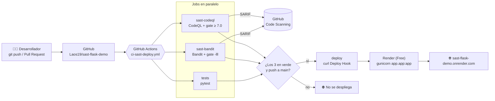

# NotasApp: escaneo de vulnerabilidades con herramientas SAST

[](https://github.com/Laos19/sast-flask-demo/actions/workflows/ci-sast-deploy.yml)


Proyecto del curso **Calidad y Pruebas de Software (SI784)**, Universidad Privada de Tacna.

NotasApp es una app Flask mínima (registro/login, notas, búsqueda y "ping a un host") que se escribió **con 5 vulnerabilidades a propósito**.
Se analizó con dos herramientas SAST de la [lista de OWASP](https://owasp.org/www-community/Source_Code_Analysis_Tools), se corrigió
y se publicó con un pipeline que **bloquea** el despliegue si aparece una vulnerabilidad de severidad alta.

| Integrante | Herramienta | Artículo |
|---|---|---|
| Antony Solorzano (2023078696) | [Bandit](https://github.com/PyCQA/bandit) | *(link pendiente)* |
| Adriana Laos (2023077474) | [CodeQL](https://codeql.github.com/) | *(link pendiente)* |

- **App en línea:** https://sast-flask-demo.onrender.com
- **Versiones:** [`v1-vulnerable`](https://github.com/Laos19/sast-flask-demo/tree/v1-vulnerable) · [`v2-corregido`](https://github.com/Laos19/sast-flask-demo/tree/v2-corregido)
- **Demo del quality gate:** [PR #1](https://github.com/Laos19/sast-flask-demo/pull/1) (reintroduce V2 → el pipeline falla y no despliega)

## Vulnerabilidades (V1–V5)

| # | Vulnerabilidad | CWE | Corrección | Bandit | CodeQL |
|---|---|---|---|---|---|
| V1 | SQL Injection (f-string) en `/buscar` | 89 | Consulta parametrizada `?` | B608 (Medium) | py/sql-injection (8.8) |
| V2 | Command Injection (`shell=True`) en `/ping` | 78 | Lista de argumentos sin shell + validar host | B602 (High) | py/command-line-injection (9.8) |
| V3 | `SECRET_KEY` escrita en el código | 798 | `os.environ["SECRET_KEY"]` | B105 (Low) | py/flask-constant-secret-key (8.5)* |
| V4 | MD5 para contraseñas | 327 | `werkzeug.security.generate_password_hash` | B324 (High) | py/weak-sensitive-data-hashing (7.5) |
| V5 | `app.run(debug=True)` | 489/94 | `debug` desde `FLASK_DEBUG`, por defecto `False` | B201 (High) | py/flask-debug (7.5) |

\* Consulta experimental de CodeQL, activada en [`.github/codeql/codeql-config.yml`](.github/codeql/codeql-config.yml).

**Antes → después:** Bandit 6 → 2 (solo Low, informativos) · CodeQL 5 → 0. Detalle en [`evidencias/05_comparativa`](evidencias/05_comparativa).

## Arquitectura



**Stack:** Python 3.12 · Flask 3.1 · SQLite · pytest · gunicorn · GitHub Actions · GitHub Code Scanning · Render.

## Ejecutar en local (Windows / PowerShell)

```powershell
python -m venv .venv
.\.venv\Scripts\python.exe -m pip install -r requirements.txt
$env:SECRET_KEY = python -c "import secrets; print(secrets.token_hex(32))"
.\.venv\Scripts\python.exe -m app.app          # http://127.0.0.1:5000
.\.venv\Scripts\python.exe -m pytest -v        # 7 pruebas
```
En Linux/macOS: `source .venv/bin/activate` y `export SECRET_KEY=...`.

## Ejecutar las herramientas SAST

### Bandit
```bash
pip install "bandit[sarif]"
bandit -r app                                  # reporte en consola
bandit -r app -f html  -o bandit.html          # también: -f json | -f sarif
bandit -r app -lll                             # quality gate: falla solo si hay severidad ALTA
```

### CodeQL
Descargar el [CodeQL bundle](https://github.com/github/codeql-action/releases) (incluye el CLI y las consultas) y luego:
```bash
codeql database create codeql-db --language=python --source-root=. --codescanning-config=.github/codeql/codeql-config.yml
codeql database analyze codeql-db --format=sarif-latest --output=codeql.sarif
python scripts/sarif_resumen.py codeql.sarif codeql.txt      # resumen legible con el flujo de datos
python scripts/sarif_gate.py codeql.sarif 7.0                # quality gate: falla si security-severity >= 7.0
```

## Pipeline (`.github/workflows/ci-sast-deploy.yml`)

| Job | Qué hace |
|---|---|
| `tests` | `pytest -v` con Python 3.12 |
| `sast-bandit` | Reportes HTML/SARIF (artifact + Code Scanning) y **gate** `bandit -r app -lll` |
| `sast-codeql` | `codeql-action/init` + `analyze` (Code Scanning) y **gate** `scripts/sarif_gate.py` |
| `deploy` | `needs` los 3 anteriores; solo en push a `main`: `curl -X POST $RENDER_DEPLOY_HOOK` |

Explicación línea por línea: [`evidencias/06_pipeline/explicacion_yaml.md`](evidencias/06_pipeline/explicacion_yaml.md).

## Estructura

```
app/            app Flask (app.py, db.py, templates/)
tests/          pytest (7 pruebas, incluidas regresiones de V1, V2, V4)
scripts/        sarif_resumen.py, sarif_gate.py
.github/        workflow y configuración de CodeQL
evidencias/     reportes antes/después, bitácora y capturas
```

> ⚠️ El tag `v1-vulnerable` contiene código inseguro **a propósito**. No lo despliegues.
