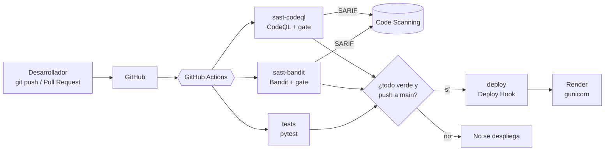

# Resumen del proyecto para los artículos

> Documento autocontenido para redactar los 2 artículos. Todas las cifras salen de los reportes de esta carpeta.
> Fecha de ejecución: 2026-10-01. Curso: Calidad y Pruebas de Software (SI784), Universidad Privada de Tacna.

## Datos generales
- **Integrantes y herramienta de cada uno:**
  - Antony Solorzano (2023078696) → **Bandit**
  - Adriana Laos (2023077474) → **CodeQL**. Originalmente tenía asignado **Bearer CLI**, que se descartó porque no reconoce Flask (ver más abajo y `10_bearer_descartado/`).
  - Herramientas excluidas por haberse usado en los laboratorios: SonarCloud (lab01), Snyk (lab02), Semgrep (lab03).
- **Repo:** https://github.com/Laos19/sast-flask-demo · **Tags:** `v1-vulnerable` (4a45522), `v2-corregido` (8be3fc5)
- **App desplegada:** https://sast-flask-demo.onrender.com
- **Ejecuciones de Actions:**
  - Vulnerable (escaneos sin bloquear): https://github.com/Laos19/sast-flask-demo/actions/runs/36840091260
  - Corregido: https://github.com/Laos19/sast-flask-demo/actions/runs/36840882782
  - Corregido + gate activo (verde, despliega): https://github.com/Laos19/sast-flask-demo/actions/runs/36843839029
  - Deploy disparado por el Deploy Hook: https://github.com/Laos19/sast-flask-demo/actions/runs/36843519408
- **PR del quality gate:** https://github.com/Laos19/sast-flask-demo/pull/1 → ejecución https://github.com/Laos19/sast-flask-demo/actions/runs/36844157546 (rojo, deploy omitido)

## Stack y arquitectura
- Python 3.12 (en local se usó 3.14.0) · Flask 3.1.2 · SQLite · pytest 8.4.2 · gunicorn 23.0.0
- GitHub (repo público) · GitHub Actions · GitHub Code Scanning (SARIF)
- Render, plan Free (Web Service Python nativo, sin Docker)
- Bandit 1.9.4 · CodeQL CLI 2.27.1 (bundle `codeql-bundle-v2.27.1`)



**La app (NotasApp):** registro/login, crear y listar notas, buscar notas y "ping a un host". 3 archivos en `app/` (~135–153 líneas en `app.py`).

| # | Vulnerabilidad | Dónde | CWE |
|---|---|---|---|
| V1 | SQL Injection (consulta con f-string) | `buscar()` | CWE-89 |
| V2 | Command Injection (`subprocess` con `shell=True`) | `ping()` | CWE-78 |
| V3 | Secreto en el código `SECRET_KEY = "super-secreto-123"` | inicio de `app.py` | CWE-798 |
| V4 | MD5 para contraseñas | `hash_password()` | CWE-327 |
| V5 | `app.run(debug=True)` | arranque | CWE-489/94 |

Explotación comprobada en local: V1 con `' OR 1=1 --` muestra la nota privada de otro usuario (`01_app_local/demo_sqli.txt`, `cap_sqli.png`).
V2 con `127.0.0.1 && whoami` ejecuta `whoami` en el servidor (`demo_cmdi.txt`, `cap_cmdi.png`).

---

## Herramienta 1: Bandit (Antony Solorzano)
- **Qué es:** analizador estático de seguridad **solo para Python**. Recorre el AST de cada archivo y aplica plugins (tests `Bxxx`) que buscan patrones inseguros.
- **Quién la mantiene:** PyCQA (Python Code Quality Authority). Nació en el OpenStack Security Project. Repo: https://github.com/PyCQA/bandit
- **Licencia:** Apache 2.0 (open source, gratis).
- **Lenguajes:** Python.
- **Lista:** OWASP Source Code Analysis Tools (entrada propia: *"Bandit is a comprehensive source vulnerability scanner for Python"*). No figura en la lista de NIST.
- **Instalación:** `pip install "bandit[sarif]"` (el extra `sarif` agrega el formato SARIF). Versión usada: 1.9.4.
- **Comandos usados:**
  ```bash
  bandit -r app -f txt   -o bandit.txt
  bandit -r app -f json  -o bandit.json
  bandit -r app -f html  -o bandit.html
  bandit -r app -f sarif -o bandit.sarif
  bandit -r app --exit-zero      # reporta sin romper el pipeline
  bandit -r app -lll             # quality gate: solo severidad alta; exit 1 si hay alguna
  ```
- **Tiempo:** ~0,4 s en local; job de CI completo 18 s (incluye instalar Python y Bandit).

### Hallazgos ANTES (`03_bandit/antes/`): 6 hallazgos (High 3 · Medium 1 · Low 2)
| ID regla | Severidad | Confianza | archivo:línea | V# |
|---|---|---|---|---|
| B404 blacklist (import subprocess) | Low | High | app/app.py:9 | extra (informativo) |
| B105 hardcoded_password_string | Low | Medium | app/app.py:18 | V3 |
| B324 hashlib (MD5) | High | High | app/app.py:29 | V4 |
| B608 hardcoded_sql_expressions | Medium | **Low** | app/app.py:114 | V1 |
| B602 subprocess_popen_with_shell_equals_true | High | High | app/app.py:128 | V2 |
| B201 flask_debug_true | High | Medium | app/app.py:136 | V5 |

### Hallazgos DESPUÉS (`03_bandit/despues/`): 2 hallazgos (solo Low)
| ID regla | Severidad | Confianza | archivo:línea | Comentario |
|---|---|---|---|---|
| B404 blacklist | Low | High | app/app.py:11 | Aparece siempre que se importa `subprocess` |
| B603 subprocess_without_shell_equals_true | Low | High | app/app.py:150 | Pide revisar la entrada; ya está validada con `host_valido()`. Se podría marcar `# nosec B603` |

### Integración en CI
```yaml
sast-bandit:
  runs-on: ubuntu-latest
  permissions:
    contents: read
    security-events: write
  steps:
    - uses: actions/checkout@v4
    - uses: actions/setup-python@v5
      with: { python-version: "3.12" }
    - run: pip install "bandit[sarif]"
    - name: Bandit (reporta sin bloquear)
      run: |
        bandit -r app -f txt --exit-zero
        bandit -r app -f html  -o bandit.html  --exit-zero
        bandit -r app -f sarif -o bandit.sarif --exit-zero
    - name: Quality gate Bandit (severidad alta)
      run: bandit -r app -lll
    - uses: actions/upload-artifact@v4
      if: always()
      with: { name: reporte-bandit, path: "bandit.html\nbandit.sarif" }
    - uses: github/codeql-action/upload-sarif@v4
      if: always()
      with: { sarif_file: bandit.sarif, category: bandit }
```

### Ventajas / limitaciones observadas
- ✔ Instalación trivial (`pip`), sin configuración, extremadamente rápido (<1 s).
- ✔ Detectó **5/5** vulnerabilidades sin ajustes. Exporta txt/json/html/sarif y el SARIF se integra en Code Scanning, que comenta en la línea del PR.
- ✔ El quality gate viene incluido: filtro de severidad `-l/-ll/-lll` más el código de salida.
- ✘ Analiza **patrones**, no flujo de datos: no sabe si `q` viene del usuario. Por eso la SQLi sale con confianza **Low** y severidad Medium.
- ✘ Con `-lll` **no bloquearía V1 (Medium) ni V3 (Low)**. Un gate solo por severidad alta deja pasar la SQLi.
- ✘ B105 depende del **nombre** de la variable (`SECRET_KEY` coincide con `secret`). Con otro nombre no lo habría detectado.
- ✘ Ruido: B404 y B603 quedan después de corregir (Low, informativos). En Code Scanning siguen como 2 alertas abiertas de nivel *Note* (`cap_code_scanning.png`).
- ✘ Solo Python.

---

## Herramienta 2: CodeQL (Adriana Laos)
- **Qué es:** motor de análisis semántico. Convierte el código en una **base de datos** y ejecuta consultas en el lenguaje QL. Hace **taint tracking**: sigue el dato desde la fuente (`flask.request`) hasta el sumidero (`execute()`, `subprocess.run()`).
- **Quién la mantiene:** GitHub (Microsoft). Viene de Semmle, que GitHub adquirió en 2019. https://codeql.github.com
- **Licencia:** el CLI es gratis para proyectos open source y para investigación académica (GitHub CodeQL Terms and Conditions). Las consultas y librerías (`github/codeql`) son MIT. En repos privados de empresas requiere GitHub Advanced Security (de pago).
- **Lenguajes:** C/C++, C#, Go, Java/Kotlin, JavaScript/TypeScript, Python, Ruby, Swift, entre otros.
- **Lista:** OWASP Source Code Analysis Tools, dentro de la entrada **GitHub Advanced Security** (*"uses CodeQL for Static Code Analysis"*). No figura en la lista de NIST.
- **Instalación (local, Windows):** bundle oficial con CLI y consultas, 698 MB (~1,5 GB descomprimido):
  ```bash
  curl -L -o codeql-bundle-win64.tar.gz https://github.com/github/codeql-action/releases/download/codeql-bundle-v2.27.1/codeql-bundle-win64.tar.gz
  sha256sum codeql-bundle-win64.tar.gz      # se verificó contra el .checksum.txt oficial
  tar -xzf codeql-bundle-win64.tar.gz       # -> codeql/codeql.exe
  ```
  En GitHub Actions no hace falta instalar nada: `github/codeql-action/init` lo descarga.
- **Configuración (`.github/codeql/codeql-config.yml`):**
  ```yaml
  name: "CodeQL NotasApp"
  queries:
    - uses: security-extended
  packs:
    python:
      - codeql/python-queries:experimental/Security/CWE-287-ConstantSecretKey/WebAppConstantSecretKey.ql
  paths:
    - app
  ```
- **Comandos usados:**
  ```bash
  codeql database create codeql-db --language=python --source-root=. --codescanning-config=.github/codeql/codeql-config.yml --overwrite
  codeql database analyze codeql-db --format=sarif-latest --output=codeql.sarif --sarif-category=python
  codeql database interpret-results codeql-db --format=csv --output=codeql.csv
  python scripts/sarif_resumen.py codeql.sarif codeql.txt   # resumen legible (script propio)
  python scripts/sarif_gate.py codeql.sarif 7.0             # quality gate (script propio)
  ```
- **Tiempo:** ~6–10 s crear la BD + ~14–16 s analizar (51 reglas) en local; job de CI 39–53 s (39 s en la ejecución #7).

### Hallazgos ANTES (`04_codeql/antes/`): 5 hallazgos (Critical 1 · High 4)
"security-severity" usa la escala de GitHub: ≥9 Critical, ≥7 High, ≥4 Medium.
| ID regla | Nivel SARIF | security-severity | Precisión | archivo:línea | V# |
|---|---|---|---|---|---|
| py/flask-constant-secret-key *(experimental)* | error | 8.5 High | high | app/app.py:19 | V3 |
| py/weak-sensitive-data-hashing | warning | 7.5 High | high | app/app.py:29 | V4 |
| py/sql-injection | error | 8.8 High | high | app/app.py:115 | V1 |
| py/command-line-injection | error | **9.8 Critical** | high | app/app.py:128 | V2 |
| py/flask-debug | error | 7.5 High | high | app/app.py:136 | V5 |

Ejemplo de flujo de datos que muestra CodeQL (V1): `request` (l.11, import) → `request.args.get("q")` (l.110) → `q` → `consulta` (l.114) → `execute(consulta)` (l.115).

Sin la consulta experimental, CodeQL detectaba **4/5** (no ve V3).

### Hallazgos DESPUÉS (`04_codeql/despues/`): **0 hallazgos**
CodeQL no marca el `subprocess.run([ejecutable, opcion, "1", host])` corregido, porque el dato del usuario ya no llega como comando ni pasa por un shell.

### Integración en CI
```yaml
sast-codeql:
  runs-on: ubuntu-latest
  permissions:
    contents: read
    actions: read
    security-events: write
  steps:
    - uses: actions/checkout@v4
    - uses: github/codeql-action/init@v4
      with:
        languages: python
        config-file: ./.github/codeql/codeql-config.yml
    - uses: github/codeql-action/analyze@v4
      with:
        category: codeql-python
        output: codeql-sarif
    - name: Quality gate CodeQL (severidad alta)
      run: python3 scripts/sarif_gate.py codeql-sarif/python.sarif 7.0
    - uses: actions/upload-artifact@v4
      if: always()
      with: { name: reporte-codeql, path: codeql-sarif/ }
```

### Ventajas / limitaciones observadas
- ✔ **Análisis de flujo de datos**: reporta con precisión "high" y muestra el camino fuente → sumidero ("Show paths" en el PR).
- ✔ Conoce Flask: `request` como fuente, `debug=True`, `SECRET_KEY`. Diferencia "MD5 sobre una contraseña" de "MD5 para cualquier cosa".
- ✔ **0 falsos positivos y 0 ruido** después de corregir. En el PR propuso un *Suggested changeset* (autofix).
- ✔ Integración nativa con GitHub: la acción sube resultados a Code Scanning sola y comenta en el PR.
- ✔ Multilenguaje.
- ✘ Pesado: bundle de 698 MB, ~1,5 GB descomprimido. Unas 50 veces más lento que Bandit.
- ✘ V3 solo con una consulta **experimental**; con la configuración por defecto se escapa el secreto en el código.
- ✘ La acción oficial **nunca falla** por hallazgos: el quality gate necesitó un script propio (`scripts/sarif_gate.py`) que lee el SARIF.
- ✘ Licencia: gratis solo para open source o investigación; en repos privados comerciales requiere un plan de pago.

---

## Comparativa Bandit vs CodeQL

| V# | Bandit | CodeQL | Bearer 2.1.1 (descartado) |
|---|---|---|---|
| V1 SQLi | ✔ B608 · Medium / conf. Low | ✔ py/sql-injection · 8.8 | ✘ |
| V2 Cmd Injection | ✔ B602 · High | ✔ py/command-line-injection · 9.8 | ✘ |
| V3 Secreto | ✔ B105 · Low | ✔* py/flask-constant-secret-key · 8.5 | ✘ |
| V4 MD5 | ✔ B324 · High | ✔ py/weak-sensitive-data-hashing · 7.5 | ✔ python_lang_weak_hash_md5 · Medium |
| V5 debug | ✔ B201 · High | ✔ py/flask-debug · 7.5 | ✘ |
| **Detectadas** | **5/5** | **5/5** (4/5 sin experimental) | 1/5 |

| Criterio | Bandit | CodeQL |
|---|---|---|
| Técnica | Patrones sobre el AST | Base de datos + consultas QL con taint tracking |
| Hallazgos antes / después | 6 / 2 (Low) | 5 / 0 |
| Falsos positivos / ruido | B404 y B603 (informativos) | Ninguno |
| ¿El gate por severidad alta bloquea las 5? | No (solo V2, V4, V5) | Sí (las 5 ≥ 7.0) |
| Tiempo local | ~0,4 s | ~20 s |
| Tiempo job CI | 18 s | 39–53 s |
| Tamaño de instalación | Unos MB (pip) | 698 MB descarga |
| Facilidad de uso | Muy alta: 1 comando, sin config | Media: crear BD + analizar; config YAML |
| Quality gate | Incluido (`-lll` + exit code) | Script propio sobre el SARIF |
| Lenguajes | Solo Python | ~10 lenguajes |
| Licencia | Apache 2.0 | Gratis para open source o investigación |

**Conclusión sugerida:** las dos herramientas se complementan. Bandit sirve como filtro rápido en cada commit, aunque sin contexto. CodeQL da hallazgos precisos y explicados, pero a mayor costo. En el PR de demo, las dos bloquearon la V2 reintroducida.

### Herramienta descartada: Bearer CLI
Bearer CLI 2.1.1 (aparece en las listas de OWASP **y** NIST) detectó solo **1/5** (MD5). En sus reglas oficiales (`Bearer/bearer-rules`, `rules/python`):
- La "entrada externa" de Python solo incluye Django, `input()`, `sys.argv`, `sys.stdin`, `argparse`, `getopt` y AWS Lambda. **No incluye `flask.request`**, así que no ve ni SQLi ni Command Injection.
- `debug_mode_enabled` y `weak_secret_key` existen solo para Django.
- No tiene binario para Windows (se corrió con Docker) y `skip-path` no excluyó `.venv`.
Detalle completo: `10_bearer_descartado/POR_QUE_SE_DESCARTO.md`.

---

## Código antes / después (V1–V5)
Ver `05_comparativa/antes_vs_despues.md` (fragmentos completos). Resumen:

| V# | Antes | Después |
|---|---|---|
| V1 | `f"... WHERE usuario_id = {session['usuario_id']} AND titulo LIKE '%{q}%'"` | `"... WHERE usuario_id = ? AND titulo LIKE ?", (session["usuario_id"], f"%{q}%")` |
| V2 | `subprocess.run(f"ping {opcion} 1 {host}", shell=True, ...)` | `host_valido(host)` (ipaddress + regex) y `subprocess.run([ejecutable, opcion, "1", host], ...)` |
| V3 | `SECRET_KEY = "super-secreto-123"` | `app.config["SECRET_KEY"] = os.environ["SECRET_KEY"]` |
| V4 | `hashlib.md5(password.encode()).hexdigest()` | `generate_password_hash(password)` / `check_password_hash(...)` (scrypt) |
| V5 | `app.run(debug=True)` | `app.run(debug=os.environ.get("FLASK_DEBUG", "0") == "1")` |

Un commit por corrección: `340949c fix(V1)` · `ffd77ca fix(V2)` · `130a758 fix(V3)` · `221be5b fix(V4)` · `8be3fc5 fix(V5)`.
Las pruebas pasaron de 4 a 7 (se añadieron regresiones de V1, V2 y V4).

## Despliegue
1. render.com → registrarse con GitHub → **New → Web Service** → repo `Laos19/sast-flask-demo`, branch `main`.
2. Language Python 3 · Build `pip install -r requirements.txt` · Start **`gunicorn app.app:app`** · Instance **Free**. Python 3.12 se toma de `.python-version`.
3. Variables de entorno: `SECRET_KEY` (botón *Generate* de Render) y `FLASK_DEBUG=0`.
4. Settings → **Auto-Deploy: Off** → copiar el **Deploy Hook**.
5. GitHub → Settings → Secrets and variables → Actions → `RENDER_DEPLOY_HOOK`.
6. El job `deploy` (`needs: [tests, sast-bandit, sast-codeql]`, solo en push a `main`) ejecuta `curl -fsS -X POST "$RENDER_DEPLOY_HOOK"`.

Por seguridad **solo se desplegó la versión corregida**: publicar `v1-vulnerable` habría expuesto una ejecución remota de comandos (V2) en internet.

## Problemas encontrados y cómo se resolvieron
| # | Problema | Solución |
|---|---|---|
| 1 | `pip` no está en el PATH de Windows | Usar `python -m pip` / el pip del venv |
| 2 | Solo Python 3.14 en local (el curso pide 3.12) | 3.14 en local; 3.12 fijado en Actions (`setup-python`) y Render (`.python-version`) |
| 3 | El payload `' OR '1'='1` no saca datos (la consulta queda `'1'='1%'`) | Usar `' OR 1=1 --` (comenta el resto) |
| 4 | **Bearer CLI no detecta Flask** (1/5) | Se cambió a CodeQL tras revisar sus reglas oficiales |
| 5 | Bearer: sin binario para Windows; `skip-path` no excluía `.venv` (1709 archivos) | Docker + escanear solo `app/` |
| 6 | CodeQL no detecta V3 con la suite estándar | Activar la consulta experimental `py/flask-constant-secret-key` en `codeql-config.yml` |
| 7 | La acción de CodeQL nunca falla por hallazgos | Script `scripts/sarif_gate.py` (umbral `security-severity >= 7.0`) |
| 8 | Bandit `-lll` no bloquea V1 (Medium) | Se documenta; para la demo se reintrodujo V2 (High en las dos herramientas) |
| 9 | Desplegar la versión vulnerable expondría RCE | Se adelantó la Fase 6: solo se desplegó `v2-corregido` |
| 10 | Render: `AppImportError: Failed to find attribute 'app' in 'app'` | Start Command `gunicorn app.app:app` (paquete.módulo:variable) |
| 11 | Render: `' OR 1=1 --` devuelve `403 Blocked` (Cloudflare) | No es un error: es el WAF de Render. Defensa en profundidad, no reemplaza corregir |
| 12 | Render no trae `ping`; SQLite se borra en cada redeploy (disco efímero) | La app avisa "ping no disponible"; aceptable para la demo |
| 13 | **SonarQube Cloud analizó el repo sin pedirlo** (su GitHub App tenía acceso a todos los repos desde el lab01) | Quitar el repo del alcance de la app de SonarCloud. No forma parte del proyecto |
| 14 | Windows: finales CRLF y BOM de `Set-Content` | `.gitattributes` con `eol=lf`; se quitó el BOM |

## Lista de capturas disponibles (`09_capturas/`)
| Archivo | Qué muestra |
|---|---|
| `cap_home.png` | Página de inicio de NotasApp en local |
| `cap_notas.png` | Lista de notas del usuario `ana` |
| `cap_sqli.png` | V1: búsqueda `' OR 1=1 --` muestra la nota privada de `beto` |
| `cap_cmdi.png` | V2: `127.0.0.1 && whoami` imprime el usuario del servidor |
| `cap_repo.png` | Repo público en GitHub |
| `cap_render_dashboard.png` | Servicio en Render "Live", con el primer deploy fallido y el segundo exitoso |
| `cap_app_online.png` | App en https://sast-flask-demo.onrender.com |
| `cap_pr_comentario_bandit.png` | En el PR #1, Code Scanning comenta B602 de Bandit en la línea 144–145 (Error) |
| `cap_pr_comentario_codeql.png` | En el PR #1, CodeQL "Uncontrolled command line" (Critical) con Suggested changeset. *Arriba aparece el bot de SonarCloud, ajeno al proyecto* |
| `cap_gate_rojo.png` | PR #1 con los checks fallidos (tests, sast-bandit, sast-codeql, Code scanning) y deploy omitido. *Incluye una fila de SonarCloud, ajena al proyecto* |
| `cap_actions_verde.png` | Ejecución #7 (ff1fde7) con quality gates activos: tests 9 s, sast-bandit 18 s, sast-codeql 39 s, deploy 3 s; 2 artifacts; total 48 s |
| `cap_artifacts.png` | Artifacts `reporte-bandit` (2,49 KB) y `reporte-codeql` (42,8 KB) |
| `cap_code_scanning.png` | Security → Code scanning en `main`: **2 abiertas** (Bandit B603 y B404, nivel *Note*) y **11 cerradas** (las 6 de Bandit y 5 de CodeQL de la versión vulnerable, ya corregidas). "Tools: 2" |
| `cap_gate_verde.png` | *(no tomada, opcional)* El estado verde con gates activos se ve en `cap_actions_verde.png` (run #7) |
| `cap_render_deploy_hook.png` | *(opcional)* Render → Events con un deploy de trigger "Deploy hook" |

**Capturas del sistema funcionando** (`09_capturas/demo/`, 15 imágenes generadas con Playwright, detalle en su `README.md`):
versión vulnerable local (01–08: inicio, registro, login, notas, búsqueda normal, **SQLi**, ping normal, **Command Injection**),
versión corregida local (09–12: la SQLi da 0 resultados, `&& whoami` → "Host no válido", el ping legítimo funciona) y
Render (13–15: inicio, registro y **bloqueo del WAF de Cloudflare** a `' OR 1=1 --`).
